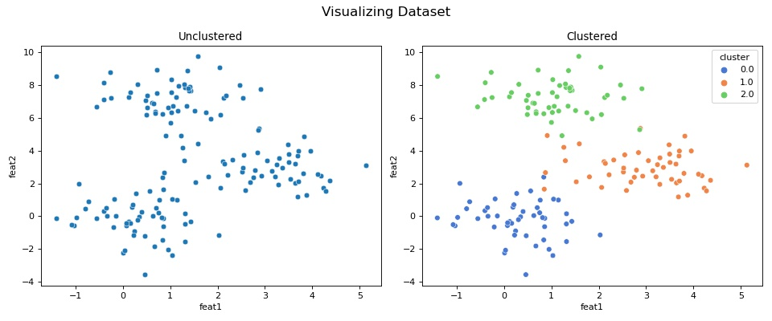

# AlapacaJapan Assignment
Repository of code assignment from AlpacaJapan as coding skill assesment.

# Description
**Assignment**:
Given a set of two dimensional points P (e.g. [(1.1, 2.5), (3.4,1.9)...]; the size of set can be100s), write a function that calculates simple K-means. The expected returned value from the function is 1) a set of cluster id that each point belongs to, and 2) coordinates of centroids at the end of iteration.

Although you can write this in any language, we would recommend for you to use python.Please feel free to research and look up any information you need, but please note plagiarism will not be tolerated.You may spend as much time as needed, but as a frame of reference, an hour would be the maximum time frame. If more time is required, please send over the intermediate code at the one hour mark.

You may start the assignment whenever you are ready. Once you have completed this task, get back to us along with the code and how long it took you.Please feel free to get in touch with me if you encounter any questions or problems.

**Requirements:**
* Minimum: implementation of the k-means function
* Expected: implement an interface similar to sklearn (subset is fine)
* Bonus: test code Bonus: visualization

**Deliverable:**  
Can be in any form such as tarball or git repo

# Workflow
To test my KMeans implementation I generate 2D random gaussian data with three different feature means, then I defined my data as having three different clusters.

Here is snippet of data visualization before and after KMeans.

## Data and Their True Labels

## Clustering with Predicted Labels vs True Labels

As can be seen, predicted labels are clustering data similarly to true labels, this shows that this KMeans implementation works.

Note that due to random assignment of initial centroids, *predicted labels might assign different color/label to data*, and this might gives low accuracy on re-run, but what matter is how data are clustered. Re-running notebook few times should gives predicted labels that are most similar to true ones. 

# Submission & Comment
* The assignment was submitted both in jupyter notebook and python script located inside py-kmeans.
* Created simulated dataset with true label so in the end visualization using my predicted and true labels can be compared.
* Included some error handlers to catch invalid parameters value, such as negative iteration, cluster number, or not 2-D data. 
* Looking forward to hear any constructive feedback regarding my work.
* I would like to apologize I took the liberty to edit code a little, readme, and add gitignore after my submission on Friday night, I promised this will be the final edit.